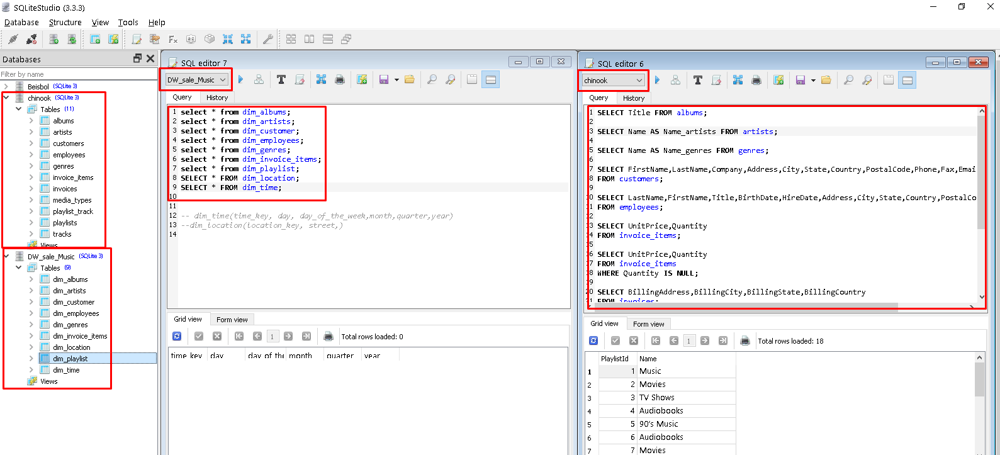

# ETL de la base de datos chinook con Python
## Materia de Modelado de base de datos avanzado
La base de datos es creada en SQLite y se utilizan dos que son:
- chinook
- DW_sale_Music "a la que se va a enviar los datos" 

###### Dimensiones de la base de datos DW_sale_Music.db
1. dim_albums
2. dim_artists
3. dim_customer
4. dim_employees
5. dim_genres
6. dim_invoice_items
7. dim_playlist
8. dim_location
9. dim_time

> Nota: las dimensiones deben tener los mismos atributos de las tablas de la base de datos chinnok solo en location los atributos salen de invoices y la dimension tiempo se realiza en todo los modelos de dimensiones.

###### Vista de base de datos
 
